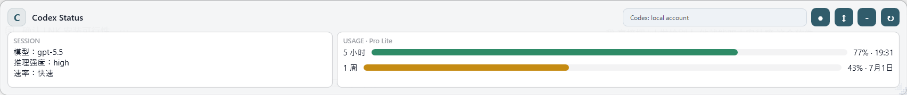

# CodexFloatingBar

> Unofficial community tool. This project is not affiliated with, endorsed by, or maintained by OpenAI.

CodexFloatingBar is a small Windows floating status bar for Codex users. It stays on your desktop and shows your current model, reasoning effort, speed tier, account, and local rate-limit status without opening logs or settings files.

CodexFloatingBar 是一个给 Codex 用户用的 Windows 桌面悬浮状态条。它会读取本机 Codex 配置和日志，在桌面上显示当前模型、推理强度、速率、账号信息和 5 小时 / 1 周额度状态。



## Download

[Download for Windows x64](https://github.com/liuguoqiang0730-svg/CodexFloatingBar/releases/latest/download/CodexFloatingBar-v0.1.2-win-x64.exe)

Or open the [latest GitHub release](https://github.com/liuguoqiang0730-svg/CodexFloatingBar/releases/latest).

## Quick Start

1. Download `CodexFloatingBar-v0.1.2-win-x64.exe`.
2. Run the file. No installer is required.
3. Use the tray icon to refresh, hide/show, enable startup, switch layout, or exit.

The app is currently unsigned, so Windows SmartScreen may warn that the publisher is unknown. That warning is about code-signing reputation, not a detected virus. The source code is public, and the release includes a checksum file for verification.

## Features

- Always-on-top floating bar for Codex desktop status.
- Horizontal and vertical layouts.
- Dark and light themes.
- Optional edge auto-collapse, controlled from the tray menu.
- Shows configured model and reasoning effort from local Codex config.
- Shows active session model, reasoning effort, and speed tier from local Codex logs when available.
- Shows Codex account name/email from local token claims without displaying the token value.
- Shows 5-hour and weekly remaining usage from local rate-limit log events.
- Uses green, yellow, and red states for usage visibility.
- Sends no telemetry and uploads no local Codex data.

## 中文说明

### 这个工具解决什么问题

使用 Codex 时，经常需要知道当前 session 用的是哪个模型、推理强度是多少、速率是什么、额度还剩多少。CodexFloatingBar 把这些信息放在一个小悬浮条里，适合一直放在桌面边缘查看。

### 安装和使用

1. 从 [最新版本](https://github.com/liuguoqiang0730-svg/CodexFloatingBar/releases/latest) 下载 Windows x64 版本。
2. 双击运行 `.exe`。
3. 通过系统托盘菜单控制显示/隐藏、刷新、开机启动、横竖版切换和自动收起。

如果 Windows 提示未知发布者，是因为当前版本还没有代码签名证书。你可以查看源码，也可以用 release 里的 `SHA256SUMS.txt` 校验下载文件。

### 读取哪些本地数据

CodexFloatingBar 只读取当前 Windows 用户目录下的本地 Codex 文件：

- `%USERPROFILE%\.codex\config.toml`
- `%USERPROFILE%\.codex\auth.json`
- `%USERPROFILE%\.codex\sessions\**\*.jsonl`
- `%USERPROFILE%\.codex\logs_2.sqlite*`
- `%USERPROFILE%\.codex\state_5.sqlite*`

这些文件只用于显示本地配置、账号身份、当前 session 状态和剩余额度。应用不会上传数据，也不会发送遥测。

### 当前限制

- Codex 本地日志格式不是公开稳定协议，未来 Codex 客户端变化后可能需要适配。
- 额度提醒依赖本机 Codex session 日志里的 rate-limit 事件；如果本机还没有相关事件，状态会显示为读取中或暂无数据。
- 当前 release 是免安装单文件版本，还没有安装器和代码签名。

## Development

### Requirements

- Windows 10 or later
- .NET 8 SDK

### Run From Source

```powershell
dotnet run --project .\src\CodexFloatingBar\CodexFloatingBar.csproj
```

### Build

```powershell
dotnet build .\CodexFloatingBar.sln
```

### Publish

```powershell
.\scripts\publish.ps1
```

The default publish output is:

```text
artifacts\publish\win-x64
```

Publishing also creates or refreshes a desktop shortcut named `CodexFloatingBar.lnk` that points to the published executable.

To use a custom .NET SDK path:

```powershell
.\scripts\publish.ps1 -DotnetPath "C:\Path\To\dotnet.exe"
```

## Local Settings

- Window placement: `%LOCALAPPDATA%\CodexFloatingBar\window-placement.json`
- Appearance settings: `%LOCALAPPDATA%\CodexFloatingBar\appearance.json`
- Startup registration: `HKCU\Software\Microsoft\Windows\CurrentVersion\Run`

## License

This project is licensed under the MIT License. See [LICENSE](LICENSE).
